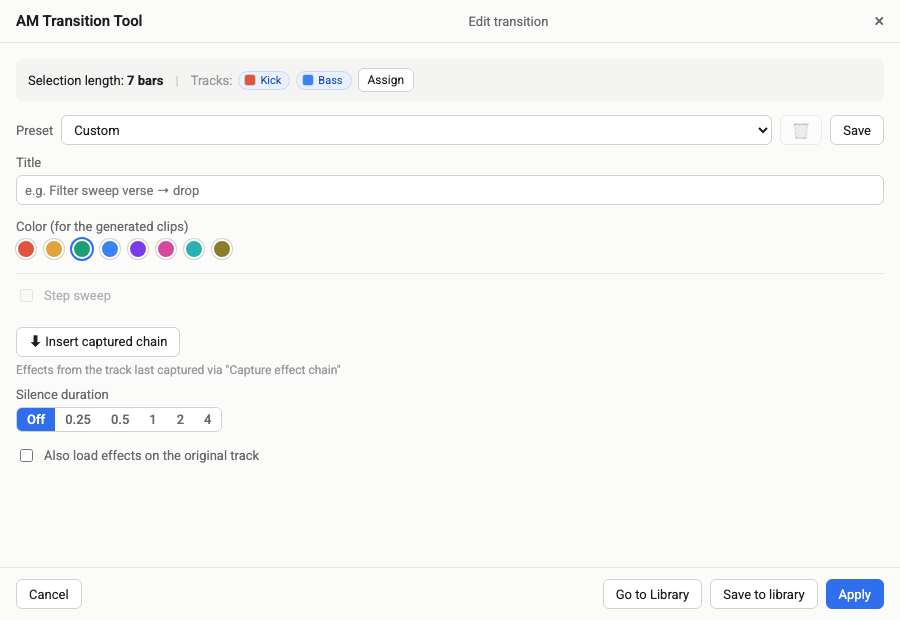
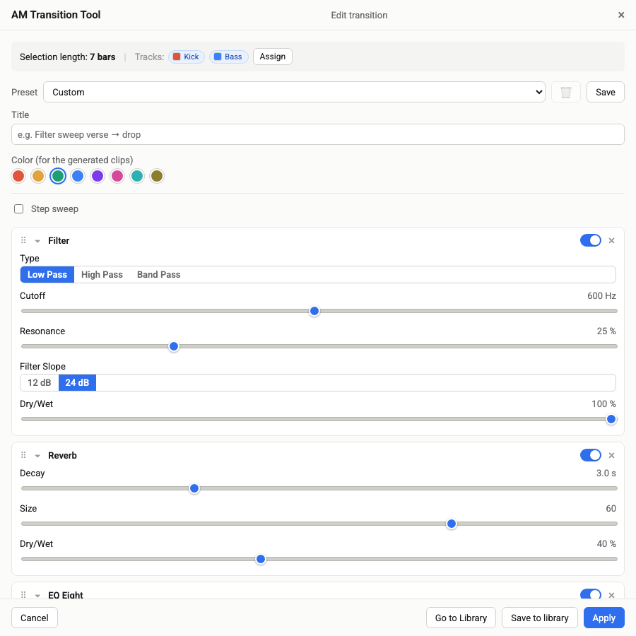
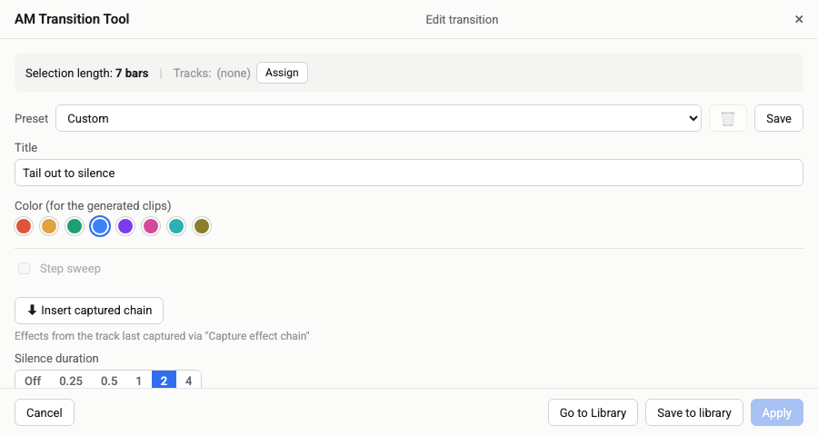
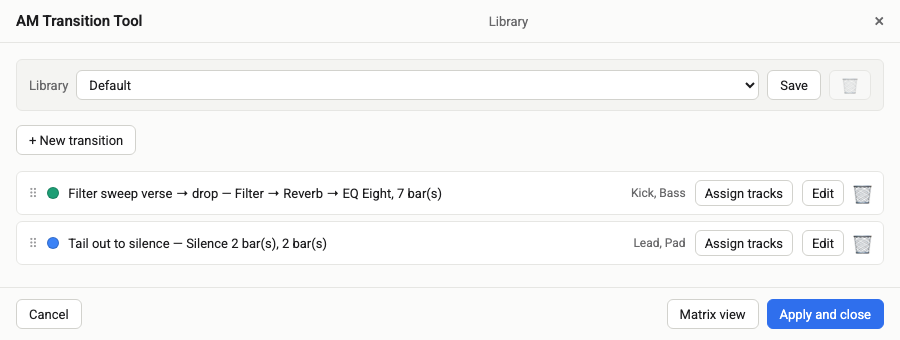
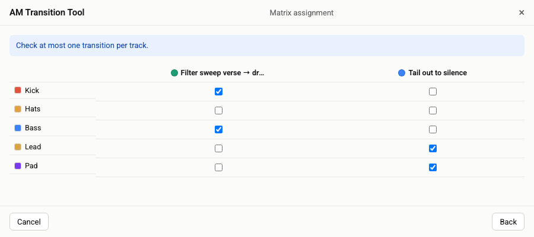

# AM Transition Tool

An Ableton Live extension for building **transitions** — effect sections (filter
sweeps, reverb tails, delay throws, …) at the end of an arrangement section — as
their own generated tracks, without touching your original clips.

## Screenshots

*(from [MOCKUP.html](MOCKUP.html), the UI reference used during development — not a live Ableton session)*

| | |
|---|---|
|  |  |
| Setting up a transition for a time selection | A captured effect chain, ready to fine-tune |
|  |  |
| Silence duration as a segmented control | Saved transitions in the Library |
|  | |
| Assigning multiple transitions to tracks at a glance | |

## What it does

Draw a time selection over the end of a section in the Arrangement, right-click
it, and choose **"Create transition…"**. The extension:

- duplicates every selected track,
- clears the original's content in that time range (so it plays silence there),
- trims the duplicate down to just that range,
- and applies an effect chain (or silence, or both) to the duplicate.

The result: a `>> `-prefixed track per original track holding the transition,
while your original arrangement stays intact except for the section it now
hands off to.

Effect chains aren't picked from a dropdown — you build them **in Live itself**
(any stock device, any parameter) on a track, then right-click that track and
choose **"Capture effect chain"**. The extension reads the whole chain
(recursing into Racks) and remembers it for the session; back in the transition
window, **"⬇ Insert captured chain"** drops it in, ready to fine-tune the
handful of parameters each effect exposes (type, cutoff, decay, drive, …).
Everything else about the captured devices comes along unchanged.

## Features

- **Library of transitions** — build several, assign different tracks to each,
  reuse them across a project via the Matrix view.
- **Presets** — save a single transition or a whole library by name, reload it
  later (with the tracks it was last assigned to).
- **Step sweep** — split a transition into 2, 4, or 8 slices with an
  interpolated value across them (a poor man's automation, see below).
- **Silence** — a transition can be pure silence, an effect, or an effect
  followed by silence, all from the same time selection.
- **11 supported effects** — Auto Filter, Delay, Reverb, Auto Pan-Tremolo,
  Chorus-Ensemble, Echo, Erosion, EQ Eight, Phaser-Flanger, Saturator, Vocoder.
  See [EFFECTS.md](EFFECTS.md) for exactly which parameters are adjustable per
  effect and which come along unchanged from the capture.

## Known limitations (and why)

Ableton's Extensions API has some hard boundaries that shaped a few design
choices here:

- **No automation.** The API can't write automation envelopes — only static
  device values. **Step sweep** works around this by generating several
  tracks, each with a different fixed value, to fake a sweep across the
  transition.
- **No track grouping.** The API can't group tracks together, so generated
  transition tracks are marked with a `>> ` name prefix instead of being folded
  into a group.
- **No loading of saved device presets (`.adg`) or plugins**, only stock
  devices at their factory default. That's why effects are captured live from
  a track you configure yourself, rather than picked from a preset list.
- **No rendering/freezing a track's processed (post-effect) audio.** If you
  want to save CPU on a transition track afterward, freeze it manually in Live
  (right-click → Freeze Track) — the extension can't do this for you.
- **Renamed devices aren't recognized.** "Capture effect chain" matches
  devices by their name, and the API has no renaming-proof way to ask "what
  kind of device is this really?" If you rename a device on the track you're
  capturing from, rename it back (or leave it as-is) before capturing.
- **A couple of effects have parameters that can't be set from a script at
  all** — e.g. Roar's Single/Multiband routing switch isn't a regular device
  parameter, so it can't be read or written via the API. Roar was removed from
  the effect catalog for this reason (replaced by Saturator).

More technical detail on all of this, plus the current architecture, lives in
[HANDOVER.md](HANDOVER.md) for anyone continuing development.

## Build & run

```bash
cd extensions/am-transition-tool
npm run build:dev   # typecheck + bundle
npm start           # build + extensions-cli run (only ONE extension can connect at a time)
```

Requires Ableton Live's Developer Mode (Preferences → Extensions) and a Set
open in Arrangement View.
